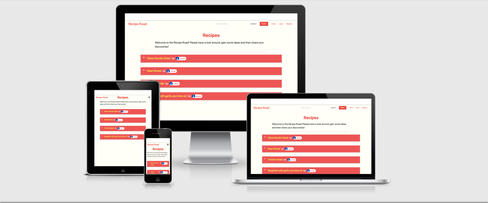
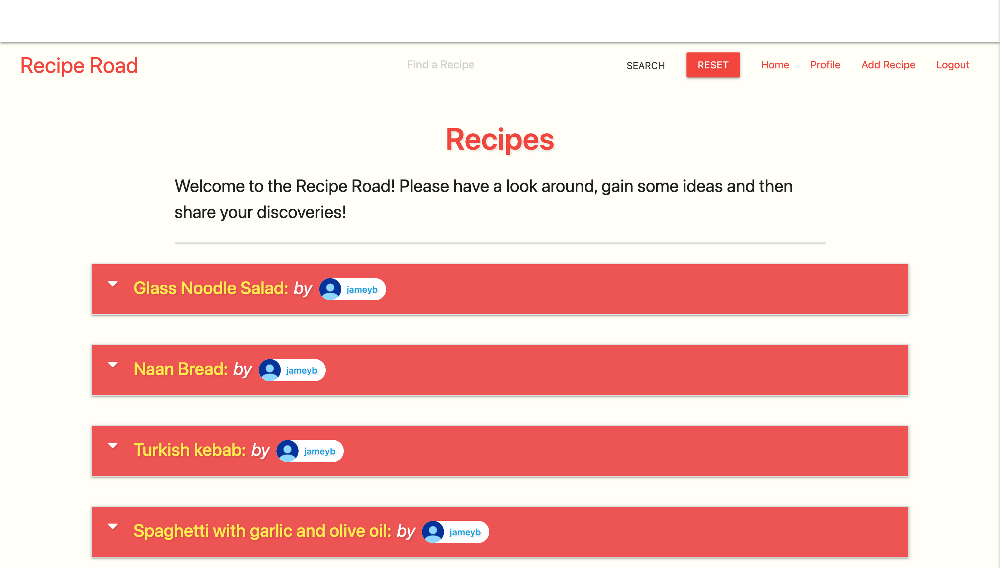
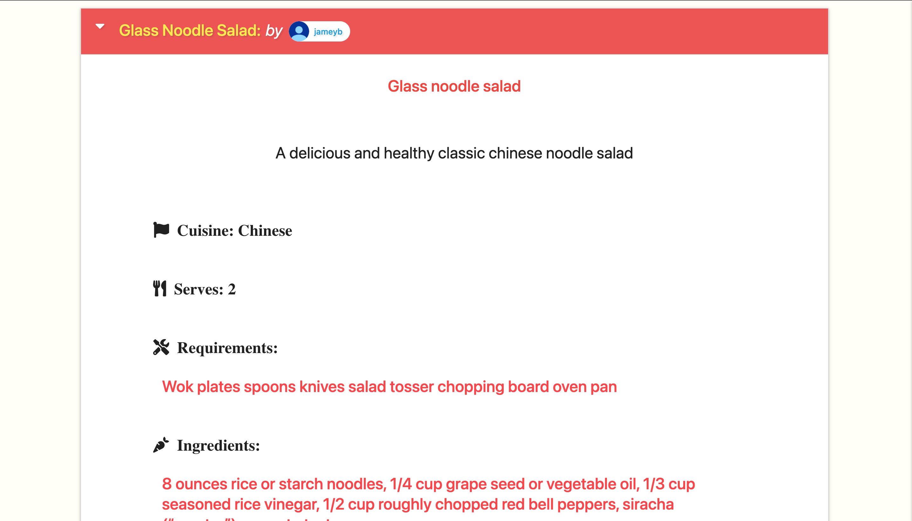
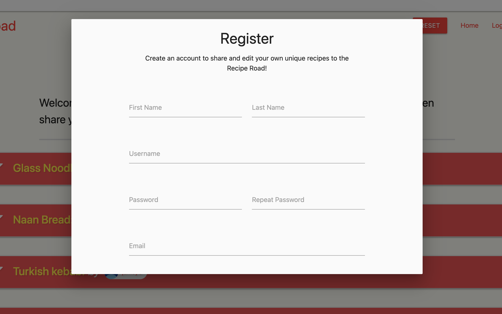
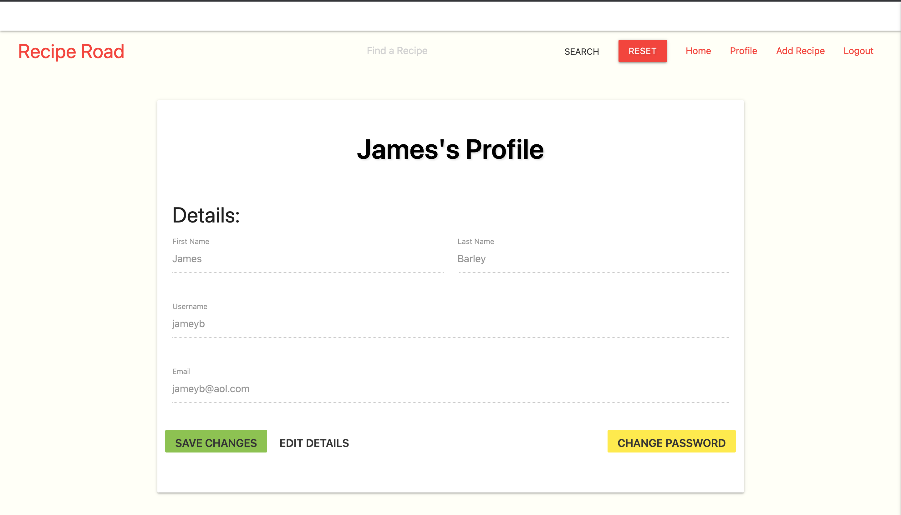
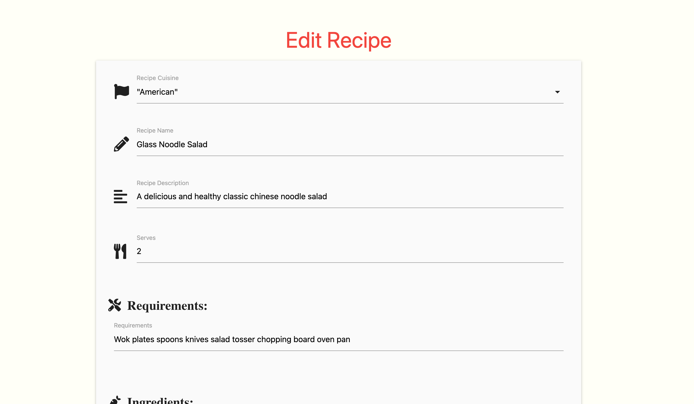
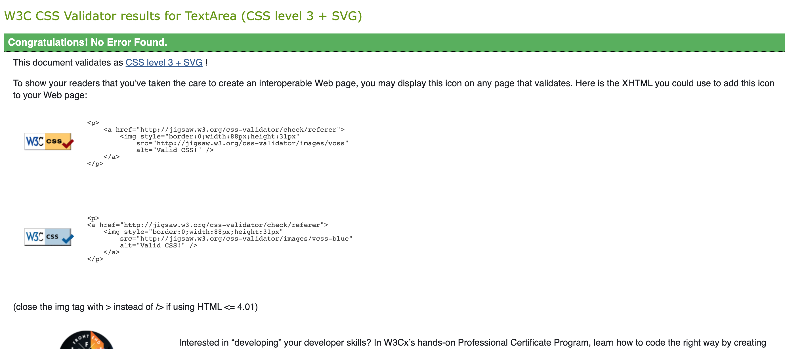
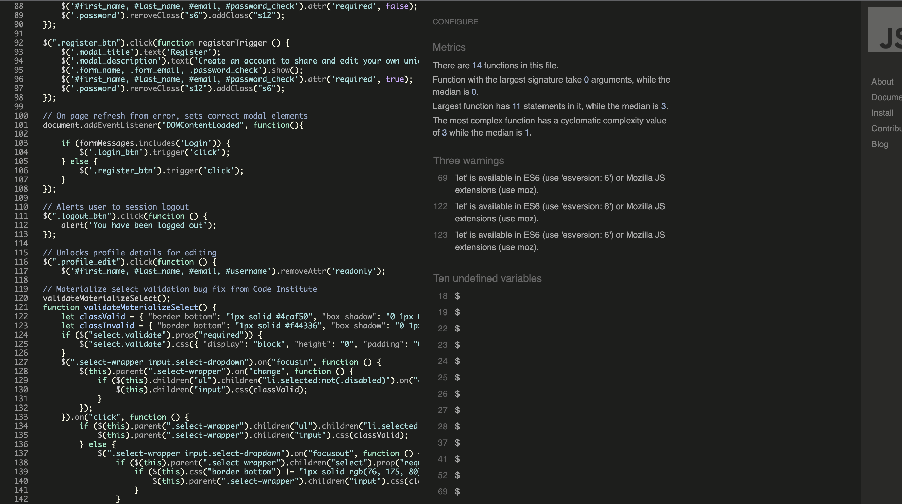
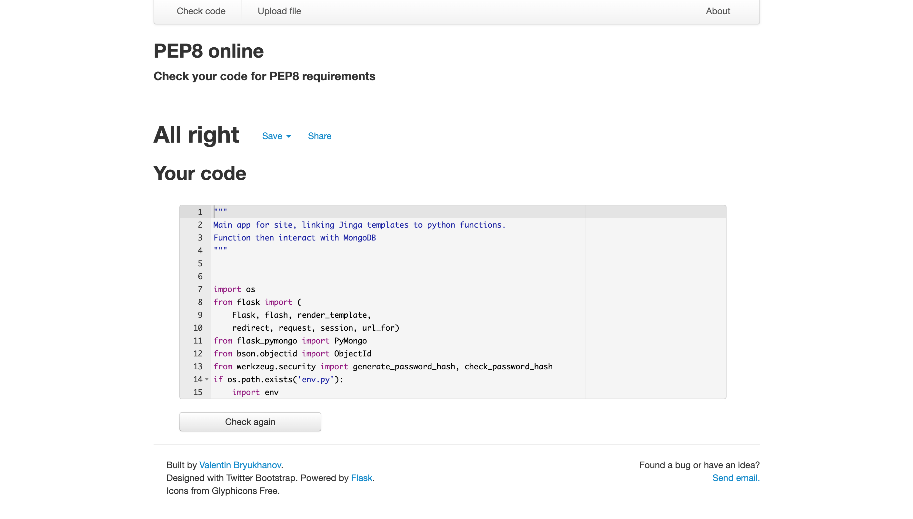

# Recipe Road

## README

#### Project Goals/Target Audience

Recipe road is an online, user contributed cookbook. Designed around the basis that users will contribute the majority of content, its core function is to host and share recipes for enjoyment and education. The focus of the site will be to encourage diversity and exploration of different cultures diets and cuisines through the categorisation of each recipe uploaded. Second to this the monetary aim of the site is to promote the use of own brand cooking appliances. This will be achieved by suggesting appliances when matched with an appropriate recipe. Required input fields for recipe requirements will ensure each upload has a list of appliances suggested.
    
The sites main goals are to attract users seeking new and interesting recipes as well as those who wish to share their own. By providing natural visual representation of cuisines and recipes available on the site it is hoped that this will spark interest and exploration. The intended result of this exploration is returning users and continued user generated content. In turn this will keep the site feeling fresh and active, whilst subtly pressing the product range.
     
Recipe Roads target audience is recommended at ages 12+, with no specific background, cultural distinction or qualifications being of any concern or consideration. The almost universal requirement to cook and enjoy food should provide ample attractiveness to the use base of the site. This coupled with the availability of more exotic products in supermarkets means people, generally, are open to and cooking more diverse cuisines, delivering a healthy user base for the Recipe Road.

 
 

## User Experience

### User Goals

- Intuitively use and navigate site
   
- Easily discover new recipes
 
- Simple to create account
 
- Simple to login/out
 
- Simplistic way to add own recipes to site
 
- Easy way to update own recipes
 
- Easy to remove own recipes
 
- Clean user interface to follow instructions whilst cooking
   
   

### Developer Goals

- Simple to use
   
- Fluid user experience
   
- Low stress usage
 
- Provide value to user
   
- High accessibility for the impaired
 
- High compatibility for user ease of access
 
- High user return rate
 
- High user contribution rate
 
- Generate monetary value by increasing sales of own brand appliances
 
 

### User Stories

* First time User Goals

  - As a first time user, I want to easily ascertain the main purpose of the site and its value to me
   
  - As a first time user, I want to easily interact with the application and its controls, visibly receiving feedback
   
  - As a first time user, I wish to be presented with new and exciting recipes to browse
   
  - As a first time user, I wish to quickly understand the variation and general contents of the site
   
   
* Returning User Goals
   
  - As a returning user I wish to explore recipes further and search more specifically
   
  - As a returning user I wish to browse recipes per my search terms to find what I am looking for
   
  - As returning user I want to know if there is a way to contribute to the catalog of recipes
   
   
* Frequent User Goals
   
  - As a frequent user, I want to be able to contribute my own recipes to the site
   
  - As a frequent user I want to be able to edit my recipes as I improve and better them
   
   
* Developer Goals
   
   - As a developer, I want new users to discover the site
   
   - As a developer, I want new users to engage and take value in the site
   
   - As a developer, I want users to contribute new content to the site
   
   - As a developer, I want users to take notice of suggested own brand appliances
   
   

## Design

### Design Choices

Beginning this stage by researching other available recipe sites I began to make a list of desirable design aspects I wanted to be included. High priority was placed on simplicity, as not to overwhelm the user with information. The use of pale colour shades stood out as a fine way to draw the user in to select information with brighter text tones, avoiding eye fatigue. The importance of symmetry became apparent during the design stage, allowing for more information on screen without a cluttered feel.

Interactivity needed to be simple and precise, one should be able to understand site navigation and controls intuitively. Large clear buttons have been adopted to aid those using small screens and/or the visually impaired. Basic instructions are applied in the form of suggestion and required fields on forms. All labels are appropriate and where a label hasn’t been used an aria-label has been, adhering to accessibility standards.

To fulfil the discovery and search aspect of the site a distinct search bar was devised and implemented to allow users to freely search all of the sites content. There’s clear search and reset buttons available for navigating away from a search without the need to reload the page.

Following the path of simplicity care has been taken to allow the user to edit their own details and update their information. A user can update their first and second names, username and email all from their profile without the need to load another page. This provides a stable and fluid experience.
 
 

### Sketches

These sketches were created at the very initial design phase following research. They represent idealised version of the site and include some concepts that did not make it into the final project. This is due to various reasons such as time constraints, feature priority and expereince/time effectivness.

[Homepage Dektop](assets/readme/landing_concept.jpg)

[Homepage Tablet](assets/readme/edit_concept.jpg)

[Homepage Phone](assets/readme/profile_concept.jpg)

[Contact Dektop](assets/readme/recipe_concept.jpg)

 
 

### Sketches
[Data Schema](assets/readme/schema.jpg)

This sketch illustrates the data schema used for the project. It was designed early in the early stages of project developement. This was to aid developement time by providing a clear vision of how data would be handled by the server and frontend of the site.

The schema shows the relationshop between the database, flask and the various MongoDB collections and their stored data. This has been used to engineer and describe the exact data required by the site and how it's passed between frontend and backend.

### Wireframes

The following wireframes were constructed within Balsamiq(link this) during the Scope Plane section of the design and planning stage for this project. They represent an early design concept that has largely been kept to through to final product. However do note that they vary slightly from the final design, this is due to practical considerations that arose during the surface plane stage. Some design aspects were altered due to time constraints and practical limitations however I feel the main aim of the project has been realised.

[Homepage Dektop](assets/readme/desktop_homepage-1.png)

[Homepage Tablet](assets/readme/mobile_homepage-1.png)

[Homepage Phone](assets/readme/ipad_homepage-1.png)

[Recipe Dektop](assets/readme/desktop_recipe-1.png)

[Recipe Tablet](assets/readme/tablet_recipe-1.png)

[Recipe Phone](assets/readme/mobile_recipe-1.png))

[Recipe Edit Page Desktop](assets/readme/desktop_recipe_edit-1.png)

[Recipe Edit Page Tablet](assets/readme/tablet_recipe_edit-1.png)

[Recipe Edit Page Mobile](assets/readme/mobile_recipe_edit-1.png)

[Recipe Edit Page Mobile](assets/readme/tablet_user-1.png)

[Recipe Edit Page Mobile](assets/readme/desktop_user-1.png)

[Recipe Edit Page Mobile](assets/readme/phone_user-1.png)

### Colours

Colours used were meticulusly selected after research reveal text heavy sites often lend a strong contrast between background and text. Observing other sites such as all recipes it was clear that a clean, soft pallet background enabled more engaging text colours.

As seen colours assigned to the background are a soft yellow/grey. This couple with the bright red nav text and recipe collapsibles provides strong contrast.

Once opened the background becomes white with black text, as staple and strong way to provide information without making the scren feel cluttered.

### Fonts

For this project fonts were left as default as they were quite adequate to portray information. The main focus is the information and this is where I wanted the used to be drawn, having clear and concise appearance was more than enough.

### Styling

The general site layout is simple by design, drawing in the users attention with bright colours to areas of naviagtional interest. Important information is left clear and unintruded.

The edit forms are clean and to the point, little styling makes it a simple affair to fill in the required fields and submit. Likewise editing user profile details follows the same suit.

## Features

### Existing Features

- Recipe View
 
- Recipe Create
 
- Recipe Edit
 
- Recipe Delete
 
- Fully Responsive
 
- User Registration
 
- User Detail Edit
 
- Recipe Search Functionality
 
- Login/Out Functionality
 
 

### Navigation Bar

Nav bar provides links to all pages and works interchangeably on all. It also provides host to the search functionality on all pages.

### Homepage

Providing the landing page users are welcomes to a clean layout of the most recently added recipes and their associated profiles. These can be expanded right here for viewing. If a user has created these, they can be edited and deleted also.

### Recipe View

Enabling users to get a more in depth look at the recipe this provides all the crucial informtion required.

### Registration

Enabling users to get create they own account to create and share recipes this is a straight forward registration form.

### User Edit Page

Enabling users to edit thier details at will. This page will check any new entered email or username to see if it has already been registered and will alert the user without releoading the page.

### Recipe Edit Page

Enabling users to alter their recipes for any mistakes or even an updated version. All fields intially filled can be rewritten entirely here.

* Additional Features

  - Site is fully responsive

  - Contains interactive elements

  - Inter-page links for navigation

  - Use of backend data to manipulate DOM

  -  Modal/Flash alerts

 
### Bugs List - Check commits for BUG-comparison images

Significant bugs were detected during the process of developing this project. During the making of this I kept a small journal noting all bugs that I encounterd and how I solved them. These correlate with the bug fixed committed during development.

1.  Login modal reloads page before displaying error messages

Fix: Added js statement to check for error message and open modal if true

2. Selecting login removed form elements as required, but they were also lost for register if user selected this after

Fix: Added js to hide elements instead of remove, then enabled these to be shown again 	when selecting register

3. Hidden input fields with required attribute prevented form submission

Fix: Used jqery to set true and false value to required attribute as necessary

4. Setting url_for in script.js causing 404 error on Jinga app routes

Fix: Moved js click events to scripts block of base.html, allowing use of python code

5. Materialise returning null values causing untaught type errors in browser console

Fix: Replaced flash message with alert to allow page to full reload and avoid errors

6. Error modal displaying login description when not required

Fix: Conditional statement added to only show description if no session user present

7. Upon editing profile details, text in form doesn’t update

Fix: Updated session user and redeclared user variable after db update, displaying new 	content

8. Upon refresh of login page due to error, wrong elements were displaying

Fix: added conditional js to check error message and apply correct elements

9. Profile page could not submit username without profile redirect variables returning none, causing crash

Fix: Redeclare session variable with form input username after conditional logic 				check it for db update

10. Font awesome icons not displaying correctly

Fix: Altered version of font awesome to ensure unity across site

11. Updated recipes were separated into single character submission

Fix:removed jinga for loops in place for app route variables

## Technologies Used

###Languages

- HTML5
- CSS
- Javascript
- jQuery
- Jinga2
- Python3

## Frameworks, Libraries & Programs Used

- VS code

    - Vs Code was used as the main editor for the project
   
- Materialize

    - Materialize was used to assist in the layout, styling and responsiveness of the site
   
- Git

    - Git was used for version control by utilising the Gitpod terminal to commit and push to Github
   
- Gitpod

    - This was used a secondary editor when away from the main workstation
   
- GitHub
    - Used to store the projects code after being pushed from git
   
- Github desktop

    - Used to clone repositories from Github to local machine to work on
   
- Balsamiq

    - Used to create wireframes and plan design of site
   

- jQuery

    - Provided with Materialize to enable certain responsive elements such as navbar
   
- Jsdelivr

    - Provided with Materialize to enable certain responsive elements
   
- Flask

    - Micro Framework used to construct web applications
 
-  Jinga2

    - Templating language used alongside flask to allow for easier database interaction and returning documents to users
 
-   MongoDB

    - Non-relational database used to store and retrieve data such as recipe fields and user login credentials
 
- PyMongo

    - Contains tools necessary for python to interact with MongoDB
 
- Heroku

    - Used to publish application
 

## Testing

### Validator Testing

Using Jinga2 within .HTML files has proved to throw out the W3 validation, however instances of using Jinga2 (and by extension Python) are the only errors shown.

CSS Validation

Javascript Validation

Python Validation

### Testing User Stories from User Experience (UX) Section

### User Goals

1. Intuitively use and navigate site
- Site buttons and navigations are clear
   
2. Easily discover new recipes
- Landing page provides search bar and recently added
 
3. Simple to create account
- Account creation is handled on landing page in one step
 
4. Simple to login/out
- Both are available within nav bar when appropriate
 
5. Simplistic way to add own recipes to site
- Recipe addition form is simple and intuative to fill in
 
6. Easy way to update own recipes
- Recipe updating is again intuitive and displays previous input information
 
7. Easy to remove own recipes
- A clear delete button is provided for users. There's also a dialogue box to check this is the users intention
 
8. Clean user interface to follow instructions whilst cooking
- Recipe layout provides strong contrast between text and background, there's also plenty of whitespace to reduce clutter
   
   

### Developer Goals

1. Simple to use
- Layout has been designed to intuitive
   
2. Fluid user experience
- Experience is smooth and doesn't require loading many pages for example to log in or out
   
3. Low stress usage
- The clear layout and labled buttons provide instruction on function
 
4. Provide value to user
- Site enables creating and sharing of recipes as deisigned
   
5. High accessibility for the impaired
- All inputs are either labled or contain aria-label attributes
 
6. High compatibility for user ease of access
- Site is fully responsible and is compatible with a number of wideley used browsers
 
7. High user return rate
- Site functions as designed, giving highest chance of user returun
 
8. High user contribution rate
- Giving users the ability to create their own accounts and recipes provides highest chance of interaction
 
9. Generate monetary value by increasing sales of own brand appliances
- Suggestions for each reipe with links to cookware site provide way to convert users to customers
 
 

### User Stories

####First time User Goals

As a first time user, I want to easily ascertain the main purpose of the site and its value to me

- Upon arrival on the landing page the site title displays cleart the name of the site and small descriptions provides clarity

 

As a first time user, I want to easily interact with the application and its controls, visibly receiving feedback

- Buttons and navigation all provide some form of visual feedback, either through css or a dialogue box message

 

As a first time user, I wish to be presented with new and exciting recipes to browse

- Landing page displays all recently uploaded recipes and provides a search bar to further discover

 

As a first time user, I wish to quickly understand the variation and general contents of the site

- Content is provided in strips of data across the page, this can be quickly expande to reveal more data on each recipe. Throgh this the user can expand their knowledge of what is available

   
   
####Returning User Goals

As a returning user I wish to explore recipes further and search more specifically

- Search functionality is available on all pages within the nav bar at the top of the screen

 

As a returning user I wish to browse recipes per my search terms to find what I am looking for

- This again is provided by the search bar allowing for specific searches of recipe title and description

 

As returning user I want to know if there is a way to contribute to the catalog of recipes

- Clicking register will reveal dialogue explaining that having and account enables the user to contribute thier own recipes

   
   
####Frequent User Goals

As a frequent user, I want to be able to contribute my own recipes to the site

- By registering an acount users can contribute their own recipes

 

As a frequent user I want to be able to edit my recipes as I improve and better them

- The ability to edit their own recipes is provided to users

 
 
#### Developer Goals

As a developer, I want new users to discover the site

- Using semantic markup and correct HTML5 practices for SEO the site will have the best opportunity to perform well on seach engines

 
As a developer, I want new users to engage and take value in the site

- Providing a clear layout, easy use and ensuring the site is free to use, this will provide incredible value to users

 

As a developer, I want users to contribute new content to the site

- Having the landing page refresh with the latest user generated content, this will encourage more users to wish to contribute

 
As a developer, I want users to take notice of suggested own brand appliances

- Attached to each recipe are suggested links, using data from the required form field "requirements". These user relevant links to the cookware site will drive sales
 
 

## Further Testing

### Black Box

This testng relates to final stage testing where most bugs have been removed. Bugs that remain are present due to time constraints. See design stage for bug reports and fixes.
Images for each are numbered and provided bellow.

Test No | Test Feature | Expected Result | Actual | Pass/Fail
------------ | ------------- | ------------ | ------------ | -------------
1 | Launch Site | Site loads homepage | | PASS |
2 | Check Navbar styling | Navbar styled correctly  | | PASS
3 | Homepage buttons | buttons in place | | PASS
4 | Font, size and style | Styled correctly | | PASS
5 | Delete Button | Opens modal/Deletes recipe | | PASS
6 | Edit Button | Loads recipe edit page | | PASS
7 | Recipe Form Validation | Edit/Create recipe inputs validate | | PASS
8 | Login/Register Form Validation | Login/Register inputs validate | | PASS
9 | User profiles link | Recipes of logged in user provide link to profile | | PASS
10 | Search Bar | Search enables searching of sites recipes | | PASS
11 | Edit User Details | User can edit own details on profile | | PASS
12 | Edit User Details | Update fails if username exists | | PASS
13 | Edit User Details | Update fails if emails exists | | PASS
14 | Recipe Delete Modal | Recipe delete modal loads when required | Modal loads for each recipe on landing page load | FAIL
15 | Recipe bar expands | Recipe bar expands, displaying recipe | | PASS
16 | Cuisine Display | Correct cuisine displayed on recipe | | PASS
17 | Cusine Display | Correct cuisine displayed on recipe edit page | Default recipe is displayed| FAIL
18 | Recipe Update | All fields update correctly | | PASS
19 | Site navbar links | Links function as expected | | PASS
20 | Recipe Suggestions | Reciepe suggestions appear and links function | | Pass

### Black Box Testing Images

[1-4, 9, 19](assets/readme/recipeview_scr.png)
[5](assets/readme/delete_modal.png)
[6-7](assets/readme/formval_scr.png)
[8](assets/readme/loginval_scr.png)
[10](assets/readme/search_val.png)
[11](assets/readme/profileedit_scr.png)
[12-13](assets/readme/editfail_scr.png)
[14](assets/readme/delete_fail.png)
[15](assets/readme/recipe_scr.png)
[16](assets/readme/editfail_scr.png)
[17](assets/readme/recipeed_scr.png)
[18](assets/readme/recipe_update.png)
[20](assets/readme/suggestions.png)

### Browsers
 - The site was tested on Google Chrome, Edge, Safari and Mozilla Firefox

### Lighthouse
 - Testing using lighthouse took place in chrome with these results

[Lighthouse Results](assets/readme/lighthouse.png)

### Devices
 - The site was tested on a variety of devices including a MacBook Pro, Dell Desktop, iPhone 11, iPad and Samsung Galaxy S20.

### Friends/Family Users
 - Family members and friends took part in testing using the site and informed of any bugs encountered

### Known Bugs

 - Delete check screen appears after login, triggered for each recipe presenet on landing page. This is related to an issue whereby the form submit for login, triggers the delete button. Within the time constraints of the project I was unfortunatly unable to resolve this issue.
   
 - Cuisine doesn't display correctly while editing an existsing recipe. It does however submit correctly to the db and displays on a searched recipe and on recipes on the landing page
   

## Deployment

### Forking the GitHub Repository

Forking the Github repository makes a copy of the original repository on our GitHub account. We can then view and/or make changes without affecting the original repository.

1. Log in to GitHub and locate the GitHub Repository
2. At the top of the Repository locate the "Fork" Button
3. You should now have a copy of the original repository in your GitHub account

### Clone to desktop

1. Donwload Github Desktop
2. Log in to GitHub and locate the GitHub Repository
3. Under the repository name, click "Clone to dektop".
4. Github dektop will ask you if you want to clone, click "Yes"
5. Click "Open in editor"
6. You have now cloned the project to your local machine
7. Take note of requirements.txt for requirements

### Gitpod Clone

1. Download the gitpod chrome extension
2. Locate the repository on Github
3. On the righthand side of the menu bar choose "Gitpod"
4. Login to Gitpod using your Github account or make a new Gitpod account
5. You have now opened a new workspace within gitpod
6. The repository is cloned to your Github
7. Take note of requirements.txt for requirements

### Setting Up Database MongoDB

Project must be cloned to desired location before completing this step

1. Login to MongoDB and create a cluster
2. Create a database named recipe_road
3. Within this create three collections names 'cuisines', 'recipes' and 'users'. *This is important as it will sync your database with the python files and code within the project.
4. Click connect and follow instructions to allow user access as desired and collect MongoDB URI

###Deploy To Heroku
1. Login to Heroku and create new app
2. Go to deploy and connect github account to Heroku
3. Go to access and add collaborator
4. Go to settings and reveal config vars. Here specify your desired IP and PORT, as well as asign a secret key
5. Within your project create an eny.py file, add this to gitignore
6. Within the env.py file import os and set default IP, PORT, MONGODB_NAME, & MONGO_URI as well as secret key
7. Once this done return to Heroku and access deploy
8. Ensure correct github repository branch is selected and select deploy branch

## Security

This app uses werkzeug hashing for login security and also requires the use of an env.py file. This stores sensitive information about the site such as secret keys for DB's and access to deployment. This should never be uploaded to a public cloud or made public.

##Assets List

ID | Filename.type | Description | Size | Location |
------------ | ------------- | ------------ | ------------ | ------------- | ------------
1 | base.html | Base Template | 12KB | Templates
2 | profile.html | Profile Page | 16KB | Templates
3 | add_recipe.html | Add Recipe Page | 11KB | Templates
4 | edit_recipe.html | Edit Recipe Page | 11KB | Templates
5 | recipes.html | Landing Page | 14KB | Templates
6 | app.py | Main Python App | 18KB | Root
7 | Procfile | Procfile | 4KB | Root
8 | readme.md | Readme | 28KB | Root
9 | blue.png | Avatar Image | 4KB | Assets/Images & Assets/Static/IMG
10| style.css | CSS File | 6KB | Assets/Static/CSS
11| script.js | Js File | 7KB | Assets/Static/JS
12| requirements.txt | Requirements | 4KB | Root

## Credits

### Code
https://webdesign.tutsplus.com/tutorials/html5-form-validation-with-the-pattern-attribute--cms-25145
Character validation using “pattern” attribute

https://stackoverflow.com/questions/31218320/bootstrap-modal-for-flask-login-form-in-the-base-html-without-sending-the-form-i
Linking modal to flask app route

https://stackoverflow.com/questions/21282049/html5-pattern-allow-specific-special-characters/23532013
input validation for special characters

https://stackoverflow.com/questions/40430576/how-i-can-open-a-materialize-modal-when-a-window-is-ready
Open model function

https://medium.com/@crawftv/javascript-jinja-flask-b0ebfdb406b3
How to pass in Javascript to Flask Applications

https://www.tutorialspoint.com/How-can-I-change-the-text-color-with-jQuery
Change text colour with jQuery

https://stackoverflow.com/questions/5451600/jquery-to-change-form-action
How to change to attributes with jQuery

https://api.jquery.com/removeclass/
remove and add classes in single function

https://www.w3schools.com/jquery/jquery_hide_show.asp
Hide/Show elements

https://docs.mongodb.com/manual/tutorial/project-fields-from-query-results/
How to return select fields from MongoDB query

https://stackoverflow.com/questions/13701923/disable-editing-default-value-of-text-input
Set HTML input to read only

https://webaim.org/resources/contrastchecker/
used to choose and check contrast of styling colours

Code Institute Materialise Bug Fix
Fixes issue where by form select validation doesn’t work correctly

https://stackoverflow.com/questions/1465249/get-lengths-of-a-list-in-a-jinja2-template
Using jinga to get length of incoming data

### Content
https://www.bbc.co.uk/food
Recipes

### Media
https://www.figma.com/community/file/1000695889468597984
User Avatars

## Ackhnowledgements
 - Patrick Justus
 - Harlow College
 - Code Institute
